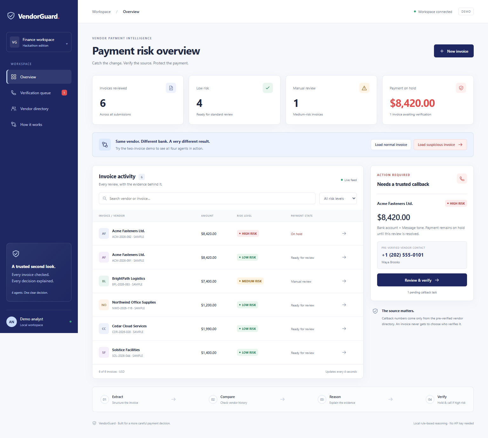

# VendorGuard

**Catch the change. Verify the source. Protect the payment.**

A complete local hackathon project that reviews vendor invoices for Business Email Compromise and invoice fraud. Four small agents extract invoice fields, compare them with a trusted vendor fingerprint, explain the risk, and create a callback task when risk is high.

The default mode needs **no API key, paid service, database installation, or frontend build step**. This version uses Node.js + Express and a responsive HTML/CSS/JavaScript dashboard. The navy, ice-blue, and coral palette matches the project brief.



## Start here

Install **Node.js 22 or newer**, which includes npm. Extract the zip, open a terminal in the `VendorGuard` folder containing `package.json`, and run:

```sh
npm install
npm start
```

Open **http://localhost:4000**. Keep that terminal running; press Ctrl+C to stop.

The first startup loads seven fictional vendor fingerprints with 28 historical invoices and six clearly marked sample reviews: four low, one medium, and one high. A high-risk callback task is visible immediately. No `.env` file is required. After installation, default operation is local and does not need internet access.

## The two-invoice demo (about 90 seconds)

1. Click **Load normal invoice**, then **Analyze invoice**. Acme Fasteners Ltd., amount **$8,420**, known bank **XXXX4471**, requester `billing@acmefasteners.example`, routine message → **LOW, 0/100**, ready for standard review.
2. Close the detail window. Click **Load suspicious invoice**, then **Analyze invoice**. Same vendor, amount, and email domain; new bank **XXXX9903** and “Please process today, I'm in back-to-back meetings” → **HIGH, 80/100**, payment **on hold**.
3. Inspect the **four-agent evidence trace**. New bank adds 60 points; unusual urgency adds 20. The matching domain stays visible: a compromised genuine mailbox would still be caught by the bank change.
4. Scroll to the callback task. It shows **Maya Brooks, +1 (202) 555-0101**, from the trusted vendor directory. The suspicious message includes a different number, **+1 (202) 555-0199**; that number is never used for verification.
5. To demonstrate a human resolution, enter a reviewer name and findings. Tick the completed-callback box and select **Confirm details · Return to review**, or select **Reject & block**. These are simulated human decisions; do not actually call the fictional numbers. Confirmation returns the invoice to standard review. Rejection blocks it. The original HIGH risk and evidence remain in the audit trail.

The **Verification queue** lists pending callbacks. The **Vendor directory** shows fingerprints and expandable invoice history. **How it works** explains the agents and scoring. The invoice feed polls every four seconds and supports search and risk filtering. Click a vendor name or row arrow to inspect a review.

Unknown vendor names are supported: they receive HIGH risk, a hold, and an onboarding task with **no callback number**. They cannot be confirmed using invoice-supplied contacts. Independently establishing and editing vendor master data is outside this demo's UI.

## Run the checks

```sh
npm test
```

The 17 automated tests start their own server on a free port with temporary storage. They do not change your dashboard data or use real Azure credentials. They cover the low/high HTTP pipeline, medium risk, input validation, trusted contacts, domain spoofing, unknown vendors, confirmation/rejection, persistence, concurrent submissions, and mocked Azure success/failure/timeout responses.

With `npm start` running in a second terminal:

```sh
npm run demo
```

This submits the two demo invoices through the real HTTP API, checks the results, prints the callback number and signals, and adds both records to the dashboard. Expected output includes:

```text
PASS LOW: ACM-2026-091 | score 0 | ready_for_review
PASS HIGH: ACM-2026-092 | score 80 | held
Trusted callback: +1 (202) 555-0101
Signals: NEW_BANK_ACCOUNT, URGENCY_LANGUAGE
```

Optional curl examples from the project folder (use `curl.exe` instead of `curl` in Windows PowerShell):

```sh
curl -X POST http://localhost:4000/api/invoices -H "Content-Type: application/json" --data-binary "@examples/low-risk.json"
curl -X POST http://localhost:4000/api/invoices -H "Content-Type: application/json" --data-binary "@examples/high-risk.json"
```

Optional browser regression checks require a separate development dependency:

```sh
npm install --no-save --package-lock=false playwright
npx playwright install chromium
node scripts/browser-smoke.js
```

That script uses an isolated database and produces screenshots in `test-results/`. It tests actual UI submissions, callback decisions, live feed updates, search, filters, vendor history, unknown-vendor handling, HTML escaping, and desktop/mobile layouts. Playwright is not required to run the app or `npm test`.

See [the test report](docs/TEST_REPORT.md) for the checks executed before packaging.

## Understand the code

```text
VendorGuard/
├── package.json                 # One install and start command for the whole app
├── package-lock.json            # Pinned dependency tree
├── .env.example                 # Optional local/Azure settings
├── backend/
│   ├── server.js                # .env loading and local HTTP listener
│   ├── app.js                   # Express endpoints and callback state transitions
│   ├── pipeline.js              # The four agents in execution order
│   ├── store.js                 # Small persistent JSON store
│   ├── agents/
│   │   ├── extractionAgent.js   # Validation, normalization, PDF/OCR TODO + example
│   │   ├── historyAgent.js      # Fingerprint checks and explicit deviation signals
│   │   ├── reasoningAgent.js    # Risk policy, rationale, optional Azure request
│   │   └── verificationAgent.js # Hold and trusted callback task creation
│   └── data/
│       ├── vendors.json         # Seven fictional vendors; trusted history
│       └── demo-invoices.json  # Low/high scenarios and first-run sample feed
├── frontend/
│   ├── index.html              # Accessible dashboard, dialogs and page structure
│   ├── styles.css              # Responsive navy/ice/coral theme
│   ├── app.js                  # Form, feed, evidence trace and review interactions
│   └── favicon.svg
├── examples/                   # Ready-to-submit JSON examples
├── scripts/                    # HTTP demo and optional browser checks
├── tests/                      # Built-in node:test suite
├── docs/                       # Test report, screenshot and original idea notes
└── runtime/                    # Created at startup; invoices.json lives here
```

Start explaining the project at `backend/pipeline.js`:

```text
Structured form / JSON
        ↓
Extraction → History → Reasoning → Verification
        ↓
Saved invoice + signals + four-step trace + optional callback task
        ↓
Dashboard / human callback outcome
```

The displayed trace contains explicit checks and policy rationale, not a model's hidden internal reasoning. Agents are modular functions orchestrated sequentially; the rule-based mode is intentionally deterministic and easy to explain.

### Risk policy

| Signal | Points | Meaning |
| --- | ---: | --- |
| Unknown vendor | 80 | No trusted baseline is available; other checks are unassessed |
| New bank account | 60 | Account is absent from the vendor master record |
| Domain mismatch | 35 | Exact email domain differs from the trusted domain |
| Amount outlier | 20 | Amount is outside the vendor's inclusive typical range |
| Unusual urgency | 20 | Recognized urgency phrases differ from historical tone |

Add points, capped at 100: **LOW 0–19**, **MEDIUM 20–59**, **HIGH 60–100**. These are illustrative policy weights, not a probability or a measured accuracy claim. A bank change alone creates a hold; other signals explain the surrounding context. Amount/domain/tone signals can also combine into HIGH risk.

Bank references ignore spaces/hyphens and letter case. Vendor lookup ignores case and surrounding whitespace. Domain matching is exact. Tone checks recognize a small explicit phrase list and compare against urgent messages in trusted invoice history; this is not a semantic language classifier. Empty email text is marked **not assessed**.

### Review states

| Result / action | Payment state | Callback state |
| --- | --- | --- |
| LOW | `ready_for_review` | None |
| MEDIUM | `manual_review` | None |
| HIGH | `held` | `pending` |
| Human confirms trusted callback | `ready_for_review` | `confirmed` |
| Human rejects invoice | `blocked` | `rejected` |

A resolved task cannot be resolved again. Confirmation requires a trusted number, an explicit callback attestation, reviewer name and findings. Rejection requires reviewer name and findings. The app records the attestation; it cannot prove a call occurred. Resolutions never add new bank accounts to the trusted fingerprint or change the original risk result. No state in this project sends actual money.

### API

| Method | Route | Purpose |
| --- | --- | --- |
| GET | `/api/health` | Server and configured reasoning mode |
| GET | `/api/vendors` | Trusted vendor fingerprints and history |
| GET | `/api/demo` | Low and high demo form data |
| GET | `/api/invoices` | All processed invoices, newest first |
| GET | `/api/invoices/:id` | Full review, trace and audit activity |
| POST | `/api/invoices` | Submit an invoice and run all four agents |
| POST | `/api/invoices/:id/verification` | Record a human callback outcome |

Required submission fields: `vendorName`, `amount`, `bankAccount`, `requesterEmail`. Optional: `invoiceNumber`, `emailText`, `currency` (USD only). Amounts must be positive, at most 100,000,000, with at most two decimal places. An omitted reference gets a generated ID. Repeated references are allowed so the same demo can run repeatedly; duplicate-payment detection is outside this version.

Callback body example:

```json
{
  "outcome": "confirmed",
  "reviewer": "Demo Analyst",
  "notes": "Called the trusted contact and independently confirmed the invoice details.",
  "callbackCompleted": true
}
```

Errors return JSON `{ "error": "..." }` with 400 for validation, 404 for missing records, 409 for already-resolved tasks, 413 for submissions over 32 KB, and 415 for unsupported content types. Unexpected processing/storage failures return 500 without exposing provider credentials.

## Optional Azure services

### Azure OpenAI — implemented, optional

Copy `.env.example` to `.env` in the project root and set:

```dotenv
AZURE_OPENAI_ENDPOINT=https://your-resource.openai.azure.com
AZURE_OPENAI_KEY=your-resource-key
AZURE_OPENAI_DEPLOYMENT=your-chat-model-deployment-name
```

Restart `npm start`. Use the Azure **resource root URL**, with no deployments path, and the actual name of a compatible chat-completion deployment. The backend calls `/openai/v1/chat/completions`, with the deployment in `model` and the key in the `api-key` header. See the [Microsoft Azure OpenAI REST reference](https://learn.microsoft.com/en-us/rest/api/microsoft-foundry/azureopenai/chat).

Only signal codes, weights, computed risk and score are sent to Azure. Raw emails, requester addresses, bank accounts and callback numbers are not sent. API keys stay server-side. The model's response appears as a separate **Azure advisory summary**; the deterministic rationale, score and payment policy stay authoritative.

Missing configuration uses local rules. Incomplete configuration, invalid output, API errors or an eight-second timeout leave the rule-based review working. The detail trace shows a fallback note when an attempted call fails. `AZURE_OPENAI_TIMEOUT_MS` can adjust the timeout up to 30 seconds. This pathway was tested with mocked provider responses; a live Azure deployment was not tested because no credentials were supplied.

### Azure AI Document Intelligence — documented extension point

Open the `TODO: AZURE AI DOCUMENT INTELLIGENCE / REAL PDF EXTRACTION` comment in `backend/agents/extractionAgent.js`. It includes an example using `@azure-rest/ai-document-intelligence`, a PDF buffer, `prebuilt-invoice`, polling, and field mapping into the existing validation function. The [Microsoft Document Intelligence JavaScript documentation](https://learn.microsoft.com/en-us/javascript/api/overview/azure/ai-document-intelligence-rest-readme) describes that SDK.

A future upload endpoint would analyze the document **before** `runPipeline()`. Review uncertain/missing OCR fields, map invoice vendor/total/reference, and obtain requester details from email metadata. Bank details may need PaymentDetails mapping or a custom model plus human review. Never turn contact information extracted from a suspicious document into the trusted callback record.

PDF upload and live OCR are deliberately not wired in this delivery, as requested. The example is commented and does not add an Azure SDK dependency to the default app.

### Storage and later deployment

The original notes propose Azure SQL, Azure hosting, and Teams alerts. Those are future integrations rather than features claimed by this local build. Replace `backend/store.js` with transactional database methods for Azure SQL/Cosmos DB; host the Express app in a Node-capable service. Add authenticated, authorized review endpoints and notifications before a shared deployment.

## Saved data and configuration

Reviews and callback decisions persist in `runtime/invoices.json` using atomic file replacement. A failed write does not report success or update the in-memory review. Use one server per data directory. Invalid/corrupt saved JSON stops startup instead of silently destroying history.

To reset sample reviews, stop the server, move `runtime/invoices.json` aside as a backup, and restart. To start with an empty feed, first set `SEED_DEMO=false` in `.env`, then start with a new data directory. The seven trusted vendor records always remain available.

Optional settings: `PORT=4000`, `HOST=127.0.0.1`, `DATA_DIR=runtime`, `SEED_DEMO=true`. Data paths resolve from the project root. The dashboard uses the same origin, so changing the port requires no frontend edits. Existing environment variables take precedence over `.env` values.

All vendors, contacts, bank references and invoices are fictional. Domains use `.example`; phone numbers are demonstration contacts. This is an explainable student prototype with local review states, not a production payment gateway. It has no login, role controls, tamper-proof audit log, real phone integration, duplicate invoice prevention or evaluated fraud-detection accuracy. Keep the default local binding for demos. Do not use it to make real payment decisions.

## Troubleshooting

- **`npm` is not recognized:** install Node.js 22+ and reopen the terminal.
- **Wrong folder / missing `package.json`:** `cd VendorGuard` after extracting; run commands from the project root.
- **Port already in use:** stop the other server, or copy `.env.example` to `.env` and change `PORT`.
- **Dashboard says connection lost:** keep `npm start` running and use its printed URL. Do not open `frontend/index.html` directly.
- **Azure not working:** inspect the fallback note, check all three environment variables, and restart. The default demo still works.
- **Storage fails:** make sure the project/data directory is writable. Restore a saved-data backup if JSON was edited incorrectly.

## Project context

Expanded from the supplied VendorGuard scaffold and Ankit Raj's idea notes. Both supplied scaffold zip files were identical. The original notes are preserved in `docs/original-idea-notes.pdf` as background, not as claims that every proposed future integration is already implemented. This README describes the delivered version.
